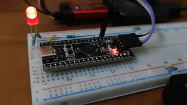

# Getting started with STM32F401

## Introduction
This is a repository where various features of STM32f401 are demonstrated with the help of simple projects. All the projects are developed for [Black Pill](https://stm32-base.org/boards/STM32F401CCU6-WeAct-Black-Pill-V1.2.html), based on STM32F401CCU6.
## Contents
```
|_ blink-timer-interrupt
|_ pwm_dma
``` 
1. [Blink using Timer Interrupt](./blink-timer-interrupt/): It is an LED blink program which is implemented using hardware timer interrupt.
<br/><br/>
2. [DMA PWM](./pwm_dma/): It is an LED fade program that keeps the CPU free and uses DMA to copy the PWM duty cycle values from a lookup table in the memory, in a cyclic mode.
<br/><br/>
