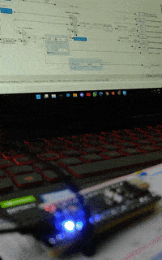

## Description
Simple LED Blink Program to verify system functioning 

## Config
- RCC
    - HSE: Crystal Resonator 25MHz
- GPIO
    - PC13: GPIO_Output (LOW)
- NVIC
    - TIM2 global interrupt
- Clock Config
    - HCLK: 80MHz
    - APB1 Timer Clock: 80MHz
- Timer: TIM2 (32bit)
    - Clock Source: Internal Clock
    - Channel 1: Output Compare CH1
    - Prescaler: 1000 (16 bit)
    - Auto Reload Register: 40000 (32 bit)
    - auto-reload-preload: Enable
    - So, Time Period of Timer Overflow (Period Elapsed) Interrupt: 40000 * 1000 / 80MHz = 0.5 s

## Demo
