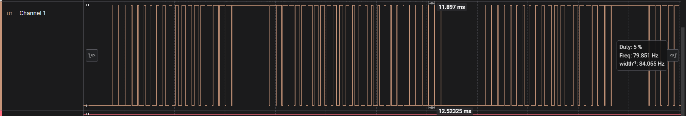
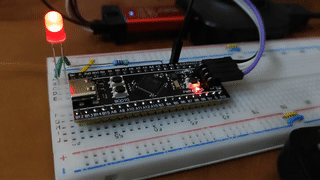
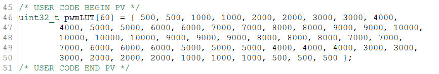

## Description
DMA PWM based LED breathing/fading effect.

## Config
- RCC
    - HSE: Crystal Resonator 25MHz
- Clock Config
    - HCLK: 84MHz
    - APB1 Timer Clock: 84MHz
- GPIO
    - No additional config needed for GPIO, driven by alternate function.
    - Driven by Timer 2 PWM channel 1.
- NVIC
    - DMA 5 global interrupt
- Timer: TIM2 (32bit)
    - Clock Source: Internal Clock
    - Channel 1: Output Compare CH1
    - Prescaler: 105 (16 bit)
    - Auto Reload Register: 10000 (32 bit)
    - auto-reload-preload: Enable
    - So, PWM Frequency = 80 Hz.

## Logic Analyser

## Demo

## Lookup Table
