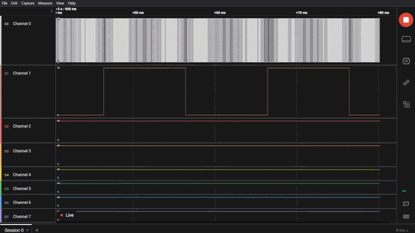

## Description
50Hz sPWM (sinusoidal PWM) generation using DMA transferred PWM. A lookup table containing the duty cycles for each pulse, generated using a [python program](./Resources/Half_Cycle_Sine_LUT.py) provided in the Resources folder in this project, is stored in the memory. The duty cycles are transferred to the capture compare register of the timer using DMA and the memory address is incremented. DMA is configured in cylic mode. So, after each cycle of the transfer completes, a full transfer complete callback is called from the ISR and a GPIO is toggled inside that ISR, indicating a successful transfer.

This project can be useful for building a basic sPWM inverter circuit which can generate a sine wave of 50Hz (as per the configuration in this example). The output of course needs to be filtered by a suitable LC low pass filter bank for eliminating the harmonics from the rectangular PWM pulses.

## Config
- RCC
    - HSE: Crystal Resonator 25MHz
- Clock Config
    - HCLK: 80MHz
    - APB1 Timer Clock: 80MHz
- GPIO
    - GPIOB Pin 5 - GPIO_Output
    - GPIOB Pin 6 - TIM4 PWM generation CH1
- NVIC
    - DMA 1
        - Stream 0 global interrupt for TIM CH1
- Timer: TIM4 (16bit)
    - Clock Source: Internal Clock
    - Channel 1 - PWM generation CH1
    - Prescaler - 4 (16bits)
    - Auto Reload Register: 1000 (16 bit)
    - auto-reload-preload: Enable
    - So, PWM Frequency, 80MHz / (4 * 1000) = 20 kHz.

## Logic Analyser Snaps
### Video:

### Overview:

### A closer look on the sPWM waveform:

## Main Code description
`sPWM_LUT` is an array containing 200 16bit unsigned integers representing the half wave of the sine curve. This array was generated by a very simple [python script](./Resources/Half_Cycle_Sine_LUT.py) that I wrote. 

The values in the array represents the duty cycle. As per the timer configuration, since the ARR is loaded with a value 1000, the duty cycle should be in the range 0 <= duty <= 1000. The number of elements, i.e., 200 is a calculated such that there are 200 pulses of 20kHz frequency which adds up to a period of 10ms for full DMA transfer completion. The HAL library in STM32 provides `HAL_TIM_PWM_PulseFinishedCallback` as the ISR function where I toggle GPIO B5 to represent successful transfer of DMA.

In the main function `HAL_TIM_PWM_Start_DMA()` is called after the clock, GPIO, timer and DMA initialisations, which starts the entire operation.

It is obvious but still interesting to note that the `while(1){}` super-loop remains free throughout the entire operation and can be used to perform other tasks in there.

