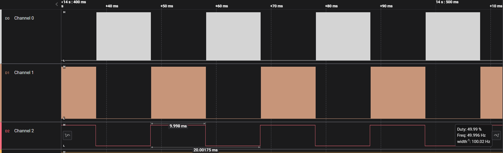
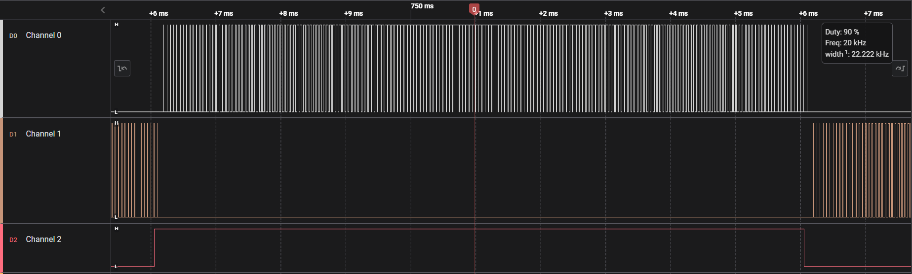
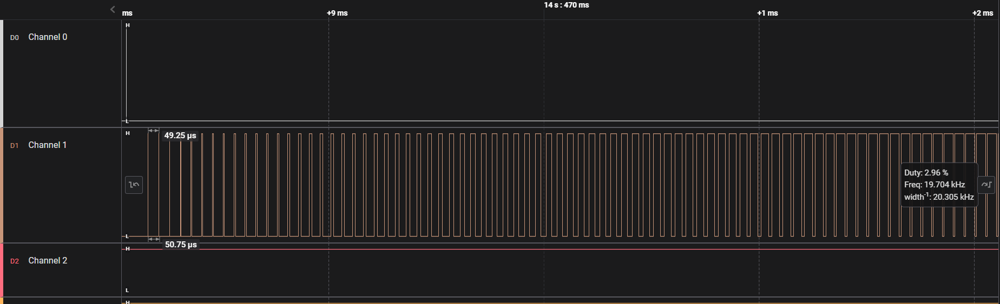
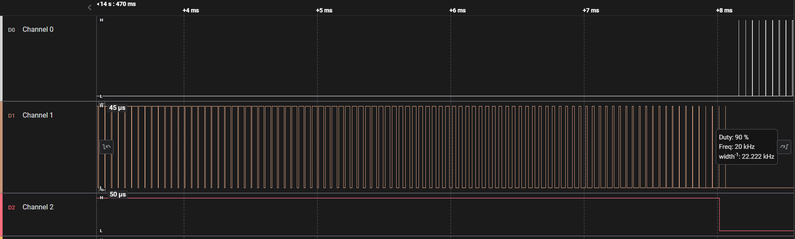
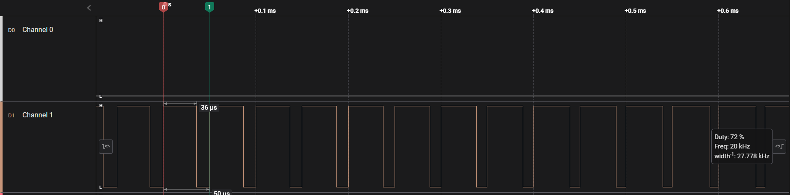

## Description
Push pull mode 50Hz sPWM (sinusoidal PWM) generation using DMA transferred PWM. A lookup table containing the duty cycles for each pulse, generated using a [python program](./Resources/Push_Pull_Sine_Lookup_Table.py) provided in the Resources folder in this project, is stored in the memory. This project is almost same as the project [sPWM-1](../sPWM-1/), however, this differs in the way it generates the PWM. Here two PWM channels from the same timer, are utilised and two lookup tables are used for transferring the data to the channels separately using DMA. 

This project can be useful for building a basic sPWM inverter circuit which can work in a push-pull mode and can generate a sine wave of 50Hz (as per the configuration in this example). The output of course needs to be filtered by a suitable LC low pass filter bank for eliminating the harmonics from the rectangular PWM pulses.

## Config
- RCC
    - HSE: Crystal Resonator 25MHz
- Clock Config
    - HCLK: 80MHz
    - APB1 Timer Clock: 80MHz
- GPIO
    - GPIOB Pin 5 - GPIO_Output
    - GPIOB Pin 6 - TIM4 PWM generation CH1
    - GPIOB Pin 7 - TIM4 PWM generation CH2
- NVIC
    - DMA 1
        - Stream 0 global interrupt for TIM CH1
        - Stream 3 global interrupt for TIM CH2
- Timer: TIM4 (16bit)
    - Clock Source: Internal Clock
    - Channel 1 - PWM generation CH1
    - Channel 2 - PWM generation CH2
    - Prescaler - 4 (16bits)
    - Auto Reload Register: 1000 (16 bit)
    - auto-reload-preload: Enable
    - So, PWM Frequency, 80MHz / (4 * 1000) = 20 kHz.

## Logic Analyser Snaps
### Video:

### Overview:

### A closer look on the sPWM waveform:

## Main Code description
Two arrays namely `sPWM_CH1_LUT` and `sPWM_CH2_LUT` containing 400 16bit unsigned integers, each representing the half waves of the sine curve.  This array was generated by a very simple [python script](./Resources/Push_Pull_Sine_Lookup_Table.py) that I wrote. 

In the main function `HAL_TIM_PWM_Start_DMA()` is called twice for each timer channel after the clock, GPIO, timer and DMA initialisations, which starts the PWM on both the channels through DMA transfer.

It is obvious but still interesting to note that the `while(1){}` super-loop remains free throughout the entire operation and can be used to perform other tasks in there.